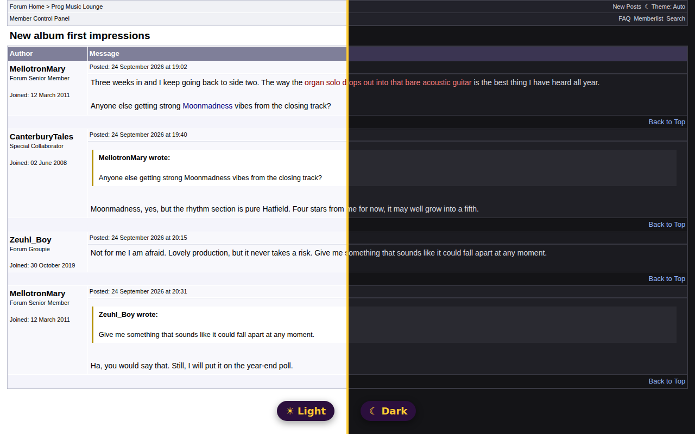

# Enhance ProgArchives Forum

A browser extension that gives the [ProgArchives.com](https://www.progarchives.com) forum a dark mode and a
more readable style. It needs no account, asks for no permissions and sends nothing anywhere.

It is unofficial: not made by or affiliated with ProgArchives.



## What it does

- **A dark theme** for every forum page. It follows your system setting, or you choose: the *Theme* link in
  the forum's own menu bar goes round Auto, Dark and Light, and remembers the choice. The stylesheet goes in
  before the page paints, so a dark page never flashes white first.
- **Members' own colours stay readable.** Text a member coloured too dark for a dark background (navy, black,
  dark red) is lightened with its hue kept, and put back when you switch to light. White tables pasted into
  posts lose their background.
- **A more readable post** in any theme: slightly larger text with more line spacing, one-line posts no
  longer in a tall empty box, and images, long words and quotes kept inside the post.
- **The forum's pages for phones** (Web Wiz's mobile view, which the forum serves to phones) get all of it,
  with the Theme switch beside the links at the top.

## Installing

- **Chrome, Edge and other Chromium browsers:** from the Chrome Web Store *(link once published)*. Or,
  from a checkout: `chrome://extensions`, turn on *Developer mode*, *Load unpacked* and pick this directory.
- **Firefox:** from addons.mozilla.org *(link once published)*. Or `about:debugging#/runtime/this-firefox`,
  *Load Temporary Add-on* and pick `manifest.json` (it lasts until Firefox restarts).
- **Safari or anything else with a userscript manager** (Userscripts, Tampermonkey, Violentmonkey):
  install [`scripts/forum-style.user.js`](scripts/forum-style.user.js) as a userscript. It is the same file
  the extension runs.

## How it works

Everything is in [`scripts/forum-style.user.js`](scripts/forum-style.user.js). The forum is Web Wiz Forums 11
with ProgArchives' "mac-prog" theme, and the script's stylesheet is written against that theme's class names
(`.tableBorder`, `.msgBody`, `.BBquote` and so on), with `!important` so it wins over the theme and over the
inline colours the pages carry. The comment at the top of the file lists the markup it relies on.

The theme choice is kept in the forum's own `localStorage` under `enhance-pa-theme`, which is also how a
userscript keeps it and how every open forum tab follows a switch made in one of them.

AwesomeProg's members' extension (in the
[progfreak](https://github.com/MikeEnRegalia/progfreak/tree/main/browser-extensions/enhance-pa) repository)
carries the same script alongside its ratings sync. With both installed, whichever starts first styles the
page and the other stands back, so there is one stylesheet and one Theme switch.

## Developing

```sh
npm install
npm test          # the tests, on made-up threads with the forum's real markup (test/fixtures/)
npm run lint      # web-ext's checks, the ones addons.mozilla.org enforces
npm run build     # the zip both stores take, in dist/
```

The fixtures are threads written for the tests, marked up exactly like the forum's classic and mobile views.
When the forum's markup changes, update them from a saved page rather than from memory.

## Publishing

Bump `version` in `manifest.json` and `@version` in the script before every upload; neither store takes the
same version twice. `npm run build` leaves the tests, the store material and the README out of the zip.

`store/listing.md` has the text for every field both stores ask for, and `store/screenshots/` the
screenshots, all 1280×800.

### Chrome Web Store

1. Register on the [developer dashboard](https://chrome.google.com/webstore/devconsole) (a one-time fee).
2. *New item*, upload the zip from `dist/`.
3. Fill in the listing and the *Privacy* tab from `store/listing.md`. The extension collects no data, so it
   needs no privacy policy.
4. Submit for review, as *Public* or *Unlisted*.

### Firefox Add-ons

1. Sign in to the [Developer Hub](https://addons.mozilla.org/developers/) (free).
2. *Submit a New Add-on*, *On this site*, and upload the zip. No source code has to go with it: the script is
   shipped as written.
3. `browser_specific_settings.gecko.id` (`enhance-pa-forum@awesomeprog.com`) is the add-on's identity there
   and must never change once uploaded. `data_collection_permissions` declares that it collects nothing.

Firefox also takes uploads from the command line, with API credentials from the Developer Hub:

```sh
npx web-ext sign --ignore-files test store 'icons/*.svg' README.md package.json package-lock.json \
  --channel listed --api-key "$AMO_JWT_ISSUER" --api-secret "$AMO_JWT_SECRET"
```

## License

[Apache License 2.0](LICENSE).
